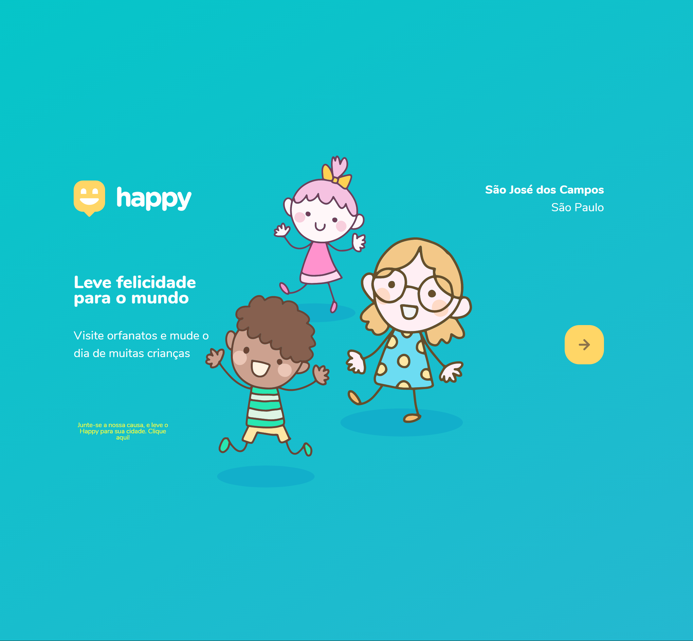

<h1 align="center">
    
</h1>

---

### 🥉 Observação

Peço desculpas em antecipado se algo "aparentar" um pouco confuso. Iniciei neste fantástico mundo da programação há 2 semanas, e estou aberto a feedbacks.

---

# 📝 About

Website desenvolvido em conjunto com a Rocketseat na semana Next Level Week, onde o propósito é levar amor, carinho e atenção para os lares de acolhimento institucional.

---

## 🚀 Tecnologias utilizadas

- [HTML5](https://developer.mozilla.org/en-US/docs/Web/Guide/HTML/HTML5)
- [CSS3](https://developer.mozilla.org/en-US/docs/Learn/CSS)
- [JavaScript](https://developer.mozilla.org/en-US/docs/Learn/javascript)
- [NodeJS](https://developer.mozilla.org/en-US/docs/Learn/Server-side/Express_Nodejs)
- [SQL (sqlite)](https://www.sqlite.org/index.html)

---

## 📁 Como baixar o projeto

```bash

    # Clonar o repositório
    $ git clone https://github.com/lrdplopes/Happy-NLW

    #Acessar o repositório
    $ cd Happy-NLW

    #Instalar suas dependências
    $yarn install

    #Iniciar o projeto
    $yarn start

```

---

Será um prazer conectar contigo através das minhas redes sociais:

✔ [Linkedin](https://www.linkedin.com/in/lucas-pereira-969a2a190/) <br>
✔ [GitHub](https://github.com/lrdplopes) <br>
✔ [Twitter](https://twitter.com/LCmeducacional) <br>

---

⚫ Desenvolvido por Lucas Pereira em conjunto com a Rocketseat. <br>
